# This file is a detailed ReadMe explaining the results that I have found from each section.

# Preprocessing

* local_highway_authority_current

For the cleaning of this column, I decided to fill the column with the same, continuous value. The results of this are displayed within the histogram below

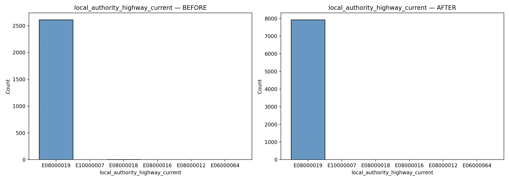

Furthermore, below is an image of the cleaning results displayed to the user

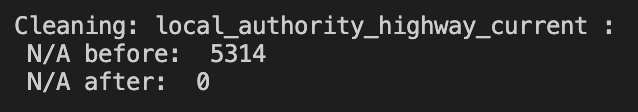

Results & Justification:

It is evident from the images provided that my cleaning method has been effectve for the local_highway_authority_current column. When I first recieved the dataset (pre-cleaning), the total number of valid rows was just over 2500. We can see this from the before histogram. As depicted in the second image (the text image), there were 5,314 N/A values present within the column. After this column had been cleaned, the histogram shows that the values present reached nearly 8000. This is accurate for the dataset as there were 7,933 total records present. To clean the column, I used mode imputation.

Therefore, I had filled every row of the dataset with the same value. This makes sense for this dataset for two reasons.

Firstly, the dataset initially contained roughly 2600 of one value. This meant that, statistically, it was extremely likely that the rest of the values were going to be the same. Secondly, the dataset is for Sheffield ONLY. Therefore, the local authority that looks after the highways will be the authority within the local area of Sheffield, meaning that it will be the same throughout the entire dataset. If it wasn't the same area code, the data present wouldn't be for sheffield and it would need to remove it from the dataset as it would present innacuracies within the model, further down the line.

* latitude & longitude

I decided to clean this column and prepare it using mean imputation. Below is the image of the graphs containing the before and after results for the longitude and latitude columns.

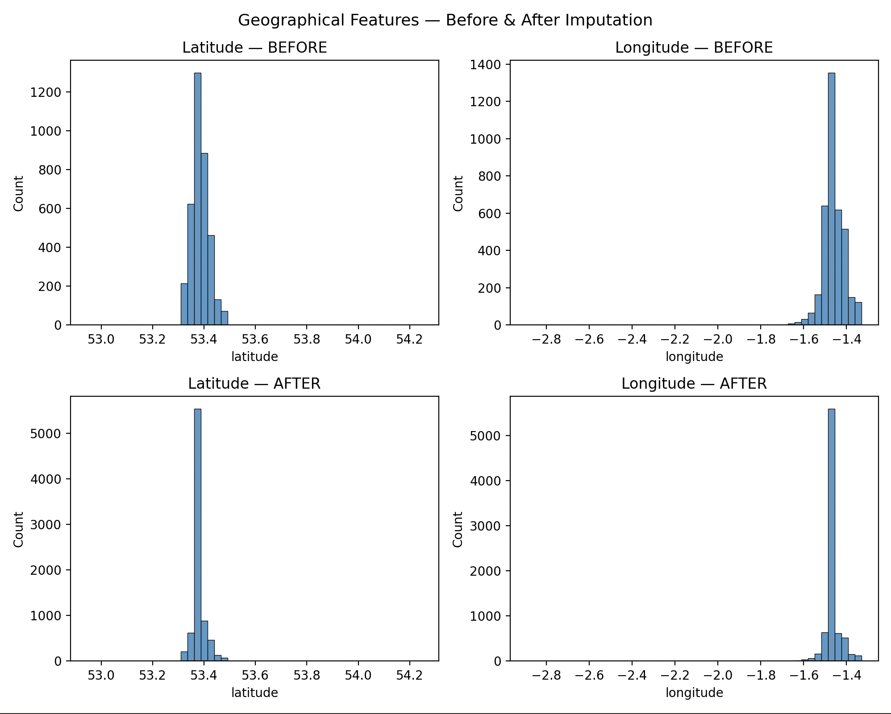

Furthermore, below is an image of the cleaning results displayed to the user

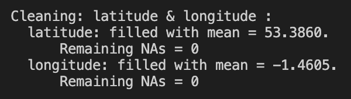

Results & Justification:

From both of the images provided above, it is clear that the mean imputation for both of the columns has been extremely effective. For the latitude column, the before image shows that the highest number of one single value for the column reached just over 1200. In the second (after) image, this same value reaches just over 5000. The same applies for the longitudinal results.

Looking at the initial data that I was provided with, I believed that it was the best option to use mean imputation for each of these columns as the data was clustered around certain points. There werent any outliers within the columns for latitude and longitude. Therefore, I was unlikely to draw any innacuracies into the dataset by entering the mean values for each column. I believe this was the right decision for the datatype and the circumstances.

* urban_or_rural_area

For the "urban_or_rural_area column, the cleaning was slightly more complicated. I decided to remove values from this column that I deemed innacurate and unnecessary and keep the values 1 and 2. I then re-mapped 1 and 2 to 0 and 1. I will justify this and explain my methodology in the results and justification section below, after the image.

The image below shows the output of the successful cleaning process for this column.

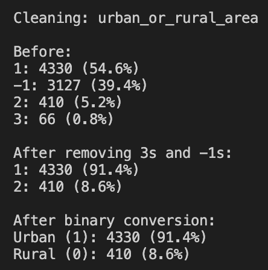

Results & Justification:

As I mentioned earlier, for this column I decided to remove some of the values that were initially present. These values were -1 and 3. My reasoning behind this decision was that I could safely deduct that the values -1 and 3 signified inaccurate values that hadn't been recorded. These values didn't make sense to be within the dataset. However, it was logical that the values 1 and 2 signified urban and rural areas.

One of the things that I was preoccupied with during this process was how low the number of accidents that occured within the rural area was. This value can be seen within the image above in the final section. It shows the value of rural accidents to be 410. Initially, I thought this value was much too low. However, upon reflection, I decided that this value was likely to be accurate as there would be much less traffic on the rural roads within the Sheffield area and therefore fewer accidents (likely only around 8.6% of accidents overall). Therefore, I decided to leave this value as it was.

One of the main reasons behind cleaning the column in this way and mapping the new values to 1 and 0 was for the binary classification. Binary Classification wouldn't have worked on this data if I had kept it as it previously was (as they weren't binary values). I will mention this further on in this file.

* location_northing_osgr & location_easting_osgr

For the location_easting_osgr and location_northing_osgr columns, I imputed the N/A values with the mean.

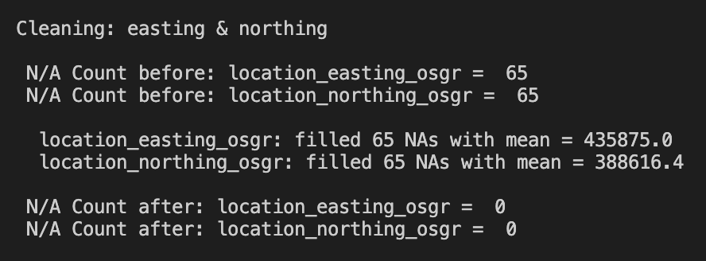

Results & Justification:

As I emphasised within the comments during this section of the code file, these two columns were actually near-perfect to begin with. Neither of them required much cleaning with only 65 rows each (a total of 130 over both columns), presenting as N/A. Over 7,933 rows in the location_easting_osgr, having just 65 N/A values meant that only 0.8% of the column needed replacing with the mean. This is the same for the location_easting_osgr column too.

I believe that mean imputation was the right choice to fill these N/A values as it reduces variances in the dataset. By this, I mean that it keeps the data within the same grographical area by using the mean and avoids accidentally creating any outliers. The data that I am imputing will follow the trend that has already been set by the other data points. I am avoiding creating any unnecessary inaccuracies here as mean imputation allows the new data to stay within the safe boundaries that currently exist within the dataset.

Furthermore, given the fact that I was only imputing the mean value into 0.8% of each column, if I was to have imputed these values inaccurarately, it is unlikely to actually have much of an effect on the accuracy of the final model itself.

* collision_adjusted_severity_serious & collision_adjusted_severity_slight

For this section, I have tried to use the mode imputation again. I also ran an initial N/A value count and a final N/A value count. I used the same logic as I did for the section above.

Evidence of the output can be found in the image below:

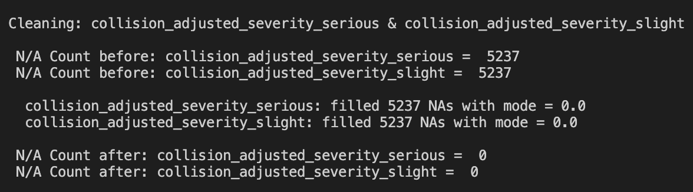

Results & Justification:

As for the section above, when using the mode for these columns, the mode was found to be 0 for each as the data is binary data and 0 is evidently the most common value in this instance.

* Outlier Detection (IQR Method)
Below are the charts generated using the IQR outlier detection method. I will now explain these results in further detail.

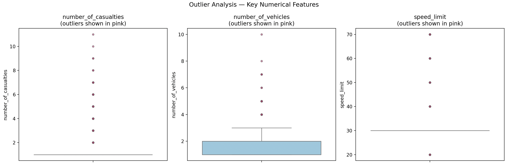

Starting from the left, the chart shows the number of casualties per incident. The line at the bottom of the chart represents the median value of the column "number_of_casualties". We can see that this value is likely to be 1. The pink dots on the graph indicate the outliers (as stated at the top of the graph). This tells me that there are some accidents that involve a high casualty count. These outliers are likely to be accurate as occasionally, there may be accidents that occur with a large number of vehicles or vehicles containing a large number of people. They could be true to life and therefore, they haven't been removed. However, it is still imporant that I am aware of them so that I can analyse them.

The middle chart shows how many vehicles are involved in each collision. On this chart, we can also see a blue box. The blue box represents the middle 50% of values. This is the IQR (interquartile range) displayed here. This means that most of the collisions that occur involve 1 to 2 vehicles. This is what I would expect to see. Again, the pink dots represent the outliers and the line represents the median. For the pink values again here, these have been left in as they are likely to be accurate values.

Moving on to the final graph on the far right, this shows the distribution of the speed limits for the crashes. The line here shows the median which is 30. This makes sense as many of the crashes were not serious accidents. These are more likely to happen at low speeds. However, as we can see from the pink dots, some of the crashes occured at much higher speeds. Again, this is very likely to be true to life.

* Final Null Value Count

At the end of the preprocessing section, I performed another null value count. This came to 0 over all of the 44 columns within the dataset. The Image of this is below. This image depicts exactly what is displayed to the user on runtime at the end of this section.

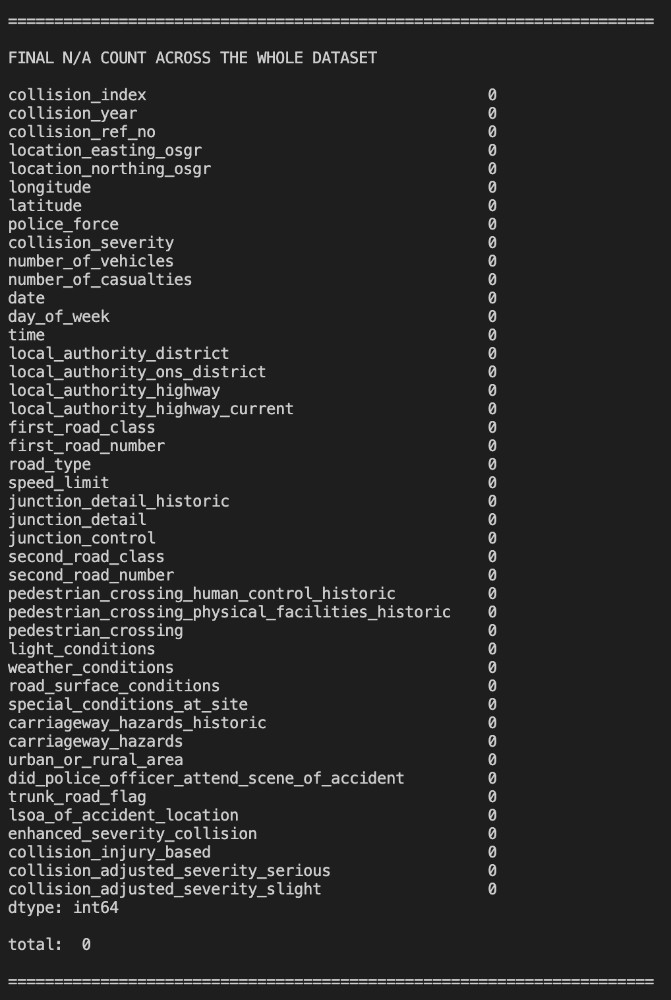

* Final Preprocessing Result Charts (Graphs)

Below is an image containing the results of the final preprocessing checks.

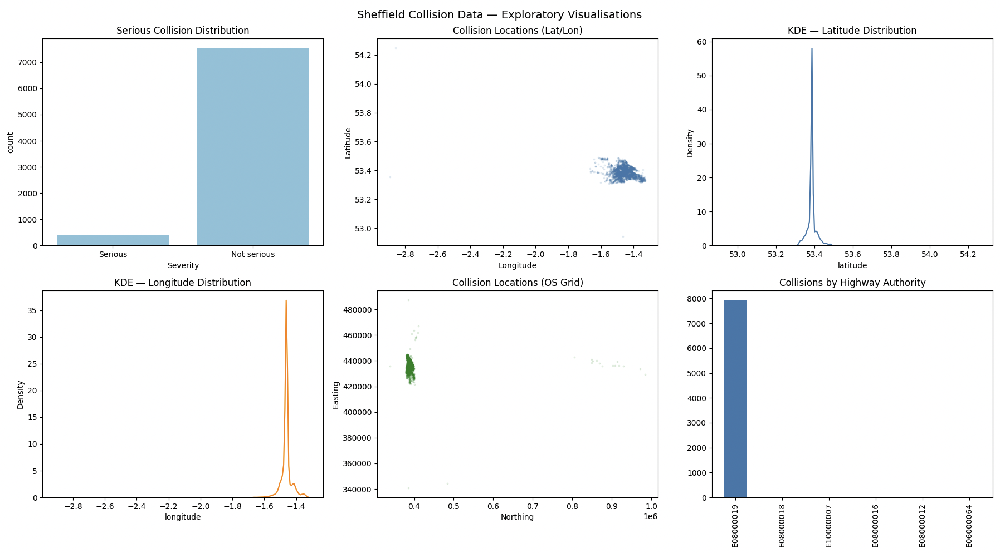

The graph on the top left depicts the final distribution for the Serious and Not Serious collisions within the data set. From the graph, we can see that there is a significantly larger number of Not Serious collisions than Serious collisions. This means that the model is likely to predict a collision to be Not Serious. However, in the real world, not serious collisions are more frequent. Therefore, the model should still be accurate.

Moving to the top middle image, this shows the geographical clustering of the accidents. It is clear from this image that the majority of these are tightly packed. This again makes sense as it depicts the collisions within the Sheffield Urban area, which only spans a certain distance. Therefore, the data depicted here is likely to be accurate. It is aslo consistent which is a positive.

The top right graph shows a KDE Plot for the latitudinal distribution. The result is that there is a very sharp peak at the top of the graph, this shows that most of the collisions occur within a narow latitudinal range. This is also a good thing for me to see as it once again reinforces that the data is accurately within the specific region of the city of Sheffield. 

The bottom left image shows a KDE plot for the longitudinal distribution. This shows the same as the latitudinal graph that I have written about above. However, this image shows there is a wider spread of data longitudinally than there was latitudinally.

The bottom middle graph shows the same type of clustering as the latitude/longitude graph above it. However, using the easting/northing data. There are a few clear outliers within this image. This confirms that the coordinate transformation between the latitude and longitude data and the easting and northing data is consistent as we see very similar results within both graphs.

Finally, the bottom right graph shows that one category dominates entirely within the column. This is accurate as the collisions recorded will be recorded through the authority based within the city of Sheffield. This was data that, as I mentioned earlier at the start of the file, I imputed myself.

# Feature Engineering

* Adding the Engineered Features to the dataset

The first task that I undertook was engineering my features. In order to do this, I needed to create new features using existing columns within the dataset.

Once I had done this, I displayed to the user which new features would be added to the dataset. An image of the new features that I added is below. I will then explain where each of the features came from. I will also add some code snippets from where I created the new features from the existing features.

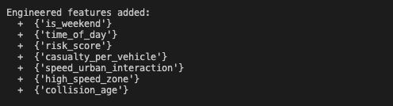

The first new feature that I added was "is_weekend". This was very simple. I did this by taking the current "day_of_week" column and using the logic "if the integer is equal to 6 or 7, it belongs to this feature meaning it is a weekend". This meant that any day of the week that wasn't taken into the new is_weekend feature was left as a normal weekday. This could then be represented within the graph which I will show later within the visualisation section of feature engineering.

The second new feature that I added was "time_of_day". This was slightly more complicated. I already had a column that was called "time". The data within this column was presented in the format of a 24-hour clock. Therefore, all I needed to do was extrapolate the hour from the column (the first piece of data), and then map it to either Night, Morning, Afternoon or Evening. I also defined "bins" for this section. These helped to place the correct time within the correct category (morning, afternoon etc)

As I stated within the comments in my code, the bins were defined as 0-6 being Night (12am to 6am), 6-12 being morning (6am to 12pm), 12-18 being afternoon (12pm - 6pm) and finally, 18-24 being evening (6pm - midnight). 

The Third new feature that I added was "risk_score". The aim of this was to calculate a total risk score that combined the number of vehicles involved in the collision with the number of casualties from the collision. It also aimed to give more weight to the number of casualties involved in the accident as they are a direct indicator or severity meaning the higher the number of casualties, the more severe the accident.

The weighting was simple, I did the following:

(number_of_vehicles x 0.4) + (number of casualties x 0.6)

The Fourth new feature that I added was "casualties_per_vehicle". This was done by using another simple calculation. I will show this calculation below:

(number_of_casualties) / (number_of_vehicles)

This could then return an estimated number of casualties per vehicle. However, this figure is not guarenteed to be accurate 100% of the time and may vary depending on the circumstances of the accident.

The Fifth new feature that I added was "speed_urban_interaction". This feature aimed to capture how speed limits may have different effects on the accidents within urban areas vs rural areas. This simply flagged the speed limit and linked it to either a rural or urban area.

The Sixth new feature that I added was "high_speed_zone". Simply, this checks whether the "speed_limit" was > (greater than) 60. If it was, it is classed as a high speed zone. Collisions within a high speed zone are more likely to be serious collisions.

The Seventh and final new feature that I added was "collision_age". This aimed to see whether there was a difference in the number of collisions in previous years comapred to nowadays. Theoretically, this could then tell me whether road safety has improved or not over the years. However, there are also other factors that come into play here. For example, there may be significantly more drivers on the roads than there has been before. This would mean that the road safety might well have improved but we may not be able to see this statistically represented here.

* Feature Engineering - Distributions

Once I had added all of my new features, I decided to display my findings on graphs, much like I did earlier for the final preprocessing results. The graphs are pictured below and I will now explain my findings.

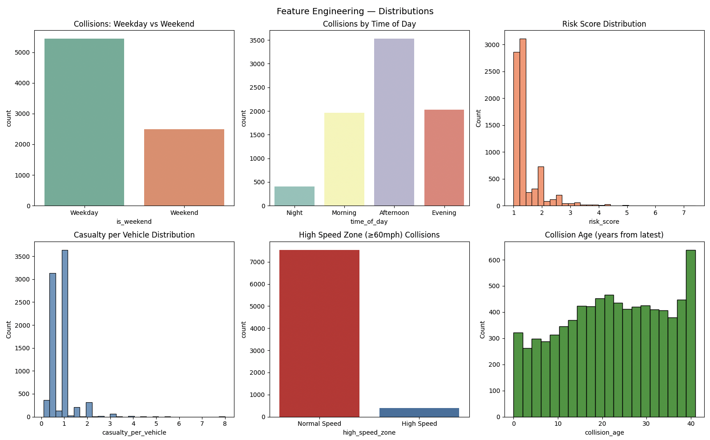

Beginning at the top left, it was found that the majority of crashed happened on a weekday with just over 5000 on a weekday and around 2500 occuring on the weekend. This seems likely to me as most people will be driving throughout the week and commuting to work. Furthermore, rush hours from monday-friday mean that there is a high density of road traffic at certain times. This is likely to lead to more collisions. The majority of which are minor (as we saw earlier in the severity chart).

The graph at the top middle of the image shows which time of day it was when the collisions occured. Once again, we can see that the charts somewhat confirm my beliefs as there are minimal accidents throughout the night and the majority happen in the afternoon between the hours of 12pm and 6pm (when the final rush hour of the day occurs). This is closely followed by the evening and then morning accidents trail slightly behind. I believe there could be a few different reasons behind the trends that we can see here.

During the final rush hour of the day (usually between 5pm and 6:30pm), most people will be leaving work. There will be a high volume of traffic on the road and people will be tired after being at work all day and want to get home as soon as possible. This could therefore lead to mistakes and evidently accidents. This could also explain why the accidents occuring in the evening section of the graph is so high. In the morning, this is likely to be slightly lower (and this is backed up by the visual evidence within the graph), as although there is a high volume of traffic on the road. People are usually going to work so they are unlikely to be as tired as when they are coming home and clearly much less likely to be involved in an accident.

Moving to the top right of the image, we can see the risk score distribution. This once again confirms what we saw earlier with the majority of the collisions being classed as "not serious", as the majoroity of the cases are between 1 and 2. This measn there weren't many vehicles involved and therefore there weren't many casualties.

Moving to the bottom left graph, we can see that the number of casualties per vehicle is mostly towards the lower end of the scale with the majority being at 1 casualty per vehicle. This would lead me to believe once again that the majority of the accidents that occur aren't serious.

Moving onto the bottom middle image, we can see that the majority of collisions occur at normal speed (any speed below 60mph). This also confirms my suspicions that the majority of accidents aren't serious. with over 7000 collisions occuring at a normal speed.

Finally, moving to the bottom right image, we can see that the number of collisions has in fact reduced over the last 40 years. This is almost certainly due to the new road safety measures and modern technolgy within cars that actually prevent them from crashing. For example, asissted/automated driving. This could also be due to stricter driving tests making for a higher standard driving across the country. This was a very interesting and surprising result for me as I didn't believe this would be the case. This was something that I hilighted earlier..

* Correlation Matrix (all features)

Below is a correlation matrix for all of the featues within the dataset. I will explain some of the key features that are related to each other, shown in the image below.

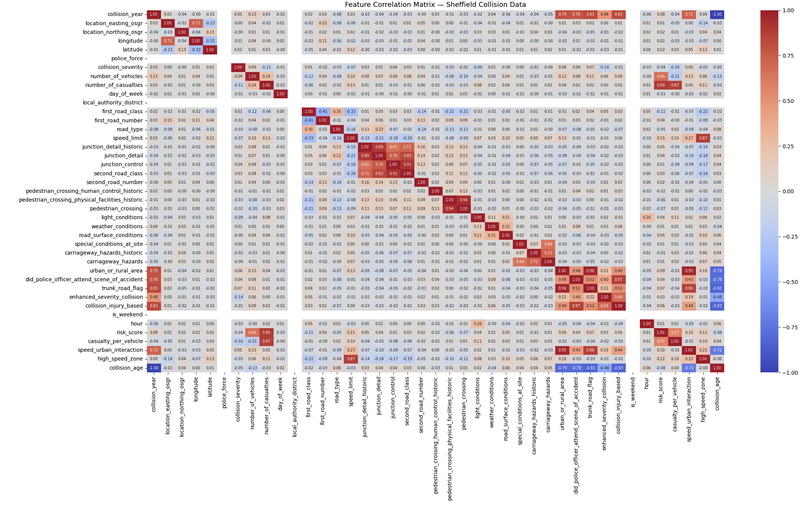

Some of the most positive correlations that we can see with the matrix above are:

junction_detail & junction_control - linked at 0.89

junction_control & second_road_class - linked at 0.91

junction_detail & second_road_class - linked at 0.83

It makes sense for these to be related as they are simply describing the types of junction and junction control that are preseent on certain roads. We can tell from this that specific types of junction and junction controls are present on second class roads.

pedestrian_crossing & pedestrian_crossing_physical_facilities_historic

This makes sense for these to have a strong correlation as it shows the previous crossing that have been in place and the current crossings that are in place. The government are unlikely to remove crossings for safety purposes. These two are linked at 0.94 which is very strong.

There are many other features which correlate strongly throughout the matrix. There are also, as expected, some features that don't have any correlation whatsoever. This is to be expected.

# Supervised Learning

* Confusion Matrix (MultiClass Severity)

Below is a confusion Matrix. I will explain what this tells me.

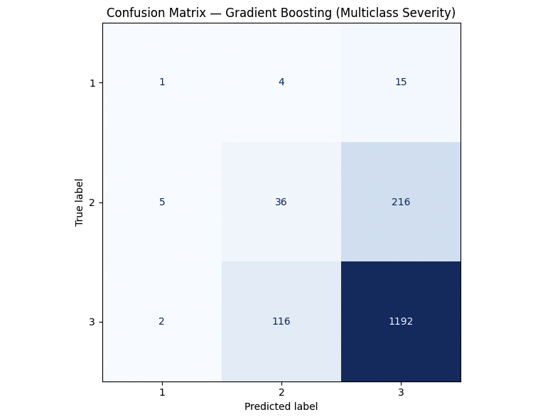

This confusion matrix shows me that my model is strongly biased towards 3. This is the most common (and least severe) category within my dataset. My model performs well here, as it identifies 1192 cases as a class 3. However, it does appear to struggle somewhat to identify the other classes. This could be because the model is defaulting towards the least severe of the classes and is inaccurate or it could be using the data properly and it understands that the least severe accidents are the most common.

* Top 10 Featrure Importances - Gradient Boosting

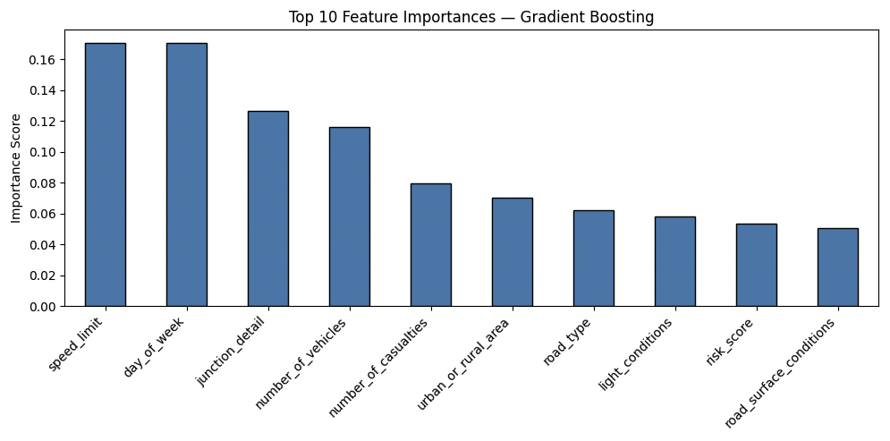

The image above shows me which features my Gradient Boosting model realies on most whilst predicting the severity of a collision. The features that it relies most heavily on are the speed_limit and the day_of_week. This tells me how fast the vehicle is likely to be travelling at the time of the accident. Weekday vs weekeend patterns also determine the level of traffic on the road and can have a big impact on the actual speed the vehicle can physically travel on the road at the time. Moving through the graph, junction_detail and number_of_vehicles also plays a large role in predicting the severity of the accident. Within the middle of the graph, the number_of_casualties, urban_or_rural_area and road_type contribute moderately to the prediction of the severity. These are still important but the model doesn't depend too highly on these. Finally, the light_conditions, risk_score and road_surface don't hold much value for the model. This makes sense as they wouldn't actually have a direct impact on the severity of the accident if a vehicle were to crash for example due to skidding on a gravel road.

* Multiclass Model Comparison
The chart below compares the four different models that I selected for multiclass severity prediction, using three different metrics (CValidation Accuracy, weighted F1 score and macro F1 score) I will now explain this in further detail.

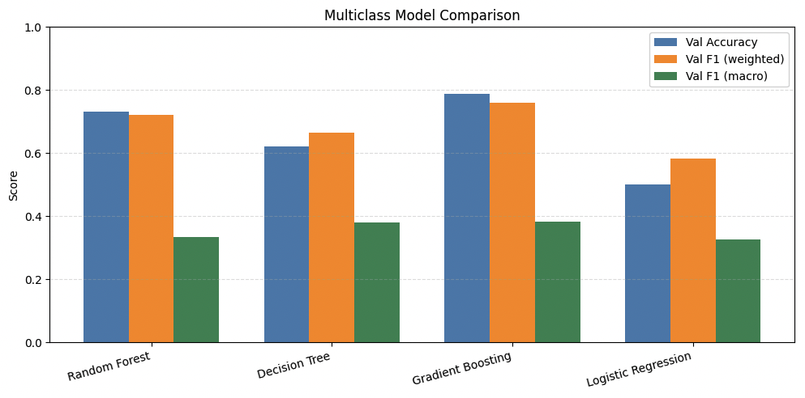

Overall, Gradient Boosting is the model that performs the best. With the highest validation accuracy at 0.8 and the highest weighted F1 score at just below 0.8. This measn that it performs best when considering the dataset as a whole and especially when taking class imbalance into consideration. However, the macro F1 score still remains relatively low at around 0.4. This isn't dissimilar to the rest of the models though.

We can also see that the RF (Random Forest) model comes next with the thats dropping slightly across the board. This still performs relatively well though.

This is followed by the Decision tree model which drops ahain and then finally by Logistic Regression which is the weakest model of the set. This has the lowest accuracy at around 0.5, low F1 scores and a macro F1 of roughly 0.3.

* ROC Curve - Binary Classification

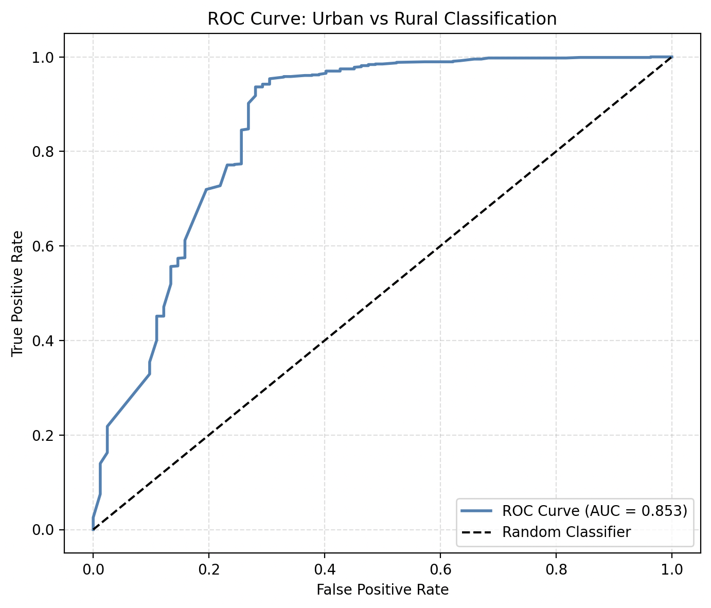

The image above shows the ROC curve for the binary classification of urban_or_rural_area. The blue line on the graph shows the performance of my model itself. The dotted line that runs diagonally through the center of the graph is a random guess at how the model will perform. The curve that relates to my model, rises steeply within the early stages of the graph (the bottom left). This shows the model is already achieveing a positive rate from the start. This shows that my model is good a predicting whether an accident occured within an urban or rural area. However, one of the issues with the dataset is that it contains a lot of data for the urban collisions but nowhere near as many for the rural collisions. This makes the dataset imbalanced.

* Confusion Matrix - Urban/Rural

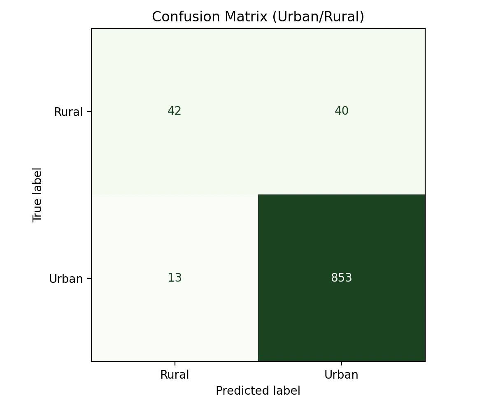

The confusion matrix above for Urban vs rural prediction shows that the model performs very well when predicting urban collisions. However, it is much less effective when predicting rural collisions. This therefore means that there is a class imbalance present. Therefore, I may need to work on some additional oversampling or using a larger sample or rural data. The issue here could simply be that there isn't much rural data within teh dataset as the majority of sheffield is contained within the city. Therefore, most of the traffic will be within the city center meaning most of the accidents occur in an urban area rather than a rural one.

* Confusion Matrix - Junction Detail

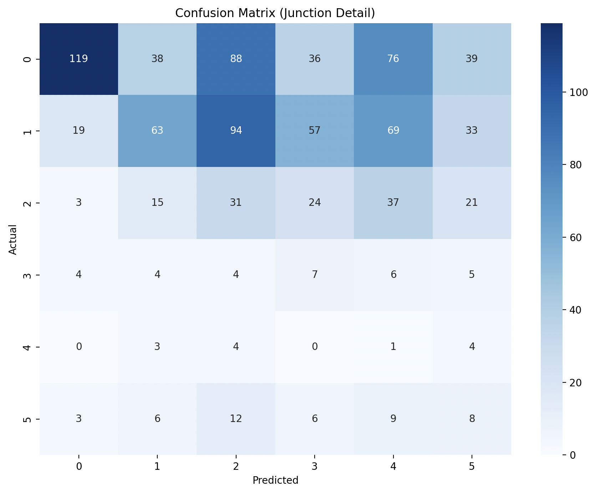

The image above shows the confusion matrix that I generated for the junction detail classification. From this image, I can gather that it doesn't predict the right amount every time. However, within the darkest cell of the confusion matrix, the model made 119 correct predictions. Other squares were significantly less over the rest of the grid. Overall, the metrix shows quite a low accuracy which is definitely something I will try and improve.

# Regression Analysis

* Actual Vs Predicted (Gradient Boosting)

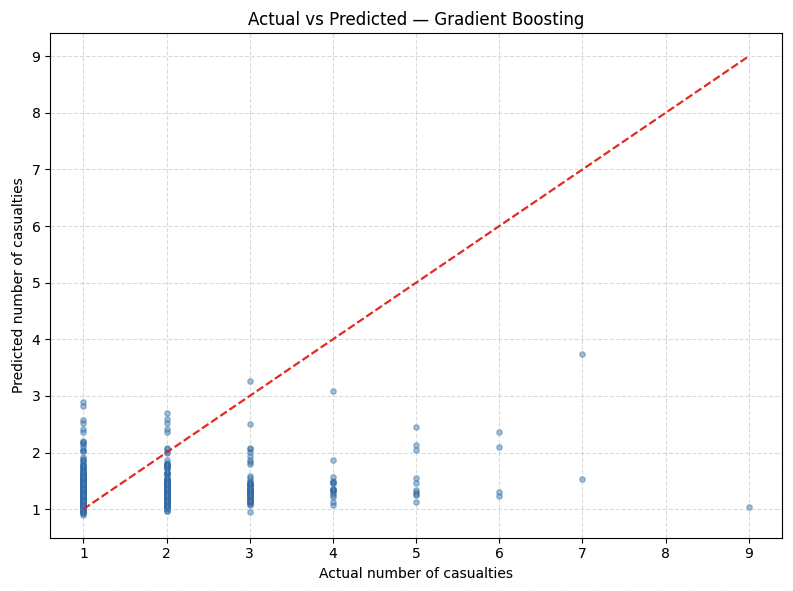

The actual vs predicted ridge regression model (the image shown above), depicts a clear pattern. The red dashed line represents a perfect preiction, where the actual and predicted values are identical. It is clear from the chart that the model's predictions are heavily clustered in a narrow band between 1 and 2 on the predicted axis. This is the same throughout the graph. This means that no matter how many casualties were actually involved in a collision, the models tends to predict a value of somewhere betweeen 1 and 2. This leads me to believe that the model is struggling to predict the full range of the target variable that I had provided. As we can see, when the number of casualties is 2, the model performs relatively well. However, it then drops off further and further away from the perfrect prediction line as the number of casualties increases.

# Unsupervised Learning

* KMeans Elbow & Silhouette Score

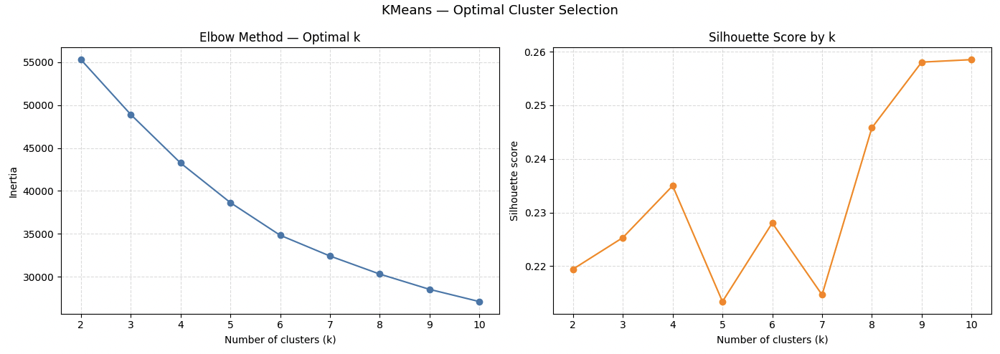

Looking at graph on the left of the image above (depicting the elbow method). It is clear that the trend drops significantly between K2 and K5, after this point, the rate of decrease starts to drop and the line begins to even out a bit more. This shows us our "elbow". In this case, the elbow isn't especially sharp which make it quite difficult to identify a specific optimal K value here. Therefore, I have included the silhouette score alognside the graph. 

Looking at the silhouette score on the right of the image, we can see that the scores fluctuate between K2 and K9. However, they reach their peak at K10 with a score of just under 0.26. There are some other obvious peaks throughout the graph for example at K4, the graph doesn't go any higher than this until K8 when it surpasses its previous record height. Based on this graph, I then chose K10 as my optimal K value.

* KMeans Clustering Results

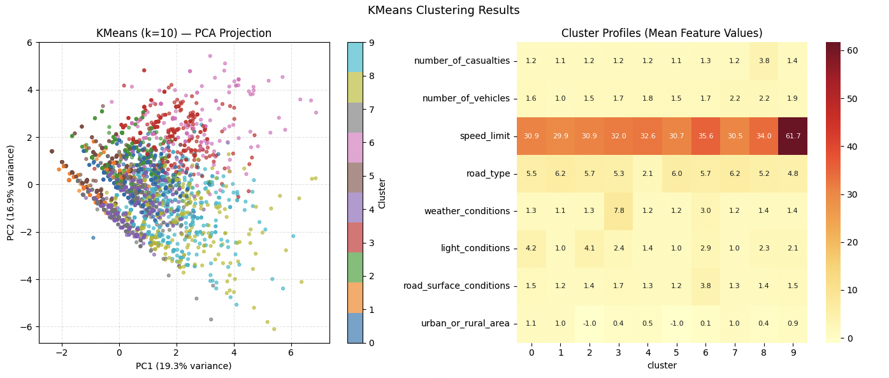

The image above shows the Kmeans clustering results including the PCA projection and a heatmap of the cluster profiles.

The KMeans clustering results produced ten clusters with some interesting patterns. The most notable cluster within the group was cluster eight.This showed an average casualty count of 3.8. This is significantly higher than all of the other clusters which sat between 1 and 1.4. Cluster eight also had one of the highest vehicle counts at 2.2. It is clear from these statistics that this cluster was representing some of the most severe collisions within the dataset.

Cluster nine also looked at more severe collisions with an average speed_limit of 61.7mph. This directly alligns with my high_speed_zone feature and suggests that these collisions picked up here may have occured on dual carraigeways or motorways. Therefore, these types of collisions are more likely to be more severe even though there are less of them. 

Looking at the PCA projection graph on the left of the image, we can see that cluster 8 has more widespread datapoints than most.

* DBSCAN Clusters For PCA Projection

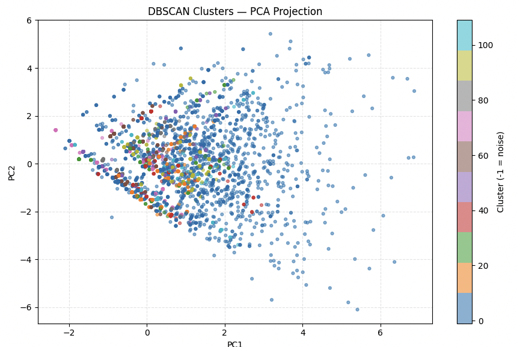

The image above shows the DBSCAN PCA Projection using clusters. This is noticeably different from the KMeans cluster that I have already mentioned. The vast majority of the points within this graph appear in a dark blue colour, this represents the largest singel cluster which is clusters 0-10 on the key. The points are spread across the projection rather than forming in specific regions. This leads me to believe that the DBSCAN found a very large number of small, specific clusters rather than small groups which would sit in specific areas. The center-left of the graph is the most densely packed area.

* Agglomerative Clustering

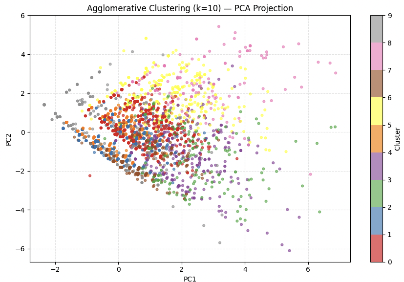

Moving on to the Agglomerative Clustering graph. This is the clearest of the three clustering results. With the clusters shown in completely different colours, it is easier to see the separation between the groups and wherabouts they sit on the graph. There is still a large overlap between several of the clusters here especially clusters 0 to 4. some of the clusters such as cluster 8 (the pink cluster) spread themselves out more, allowing for more distance between them and the main grouping at the center left of the graph.

# Model Performance & Evaluation

* Multiclass Model Comparison 

I have already completed a detailed analysis of the image below within an earlier section. This can be found, within the supervised learning section.

* Regression Model Comparison (MAE & RMSE)

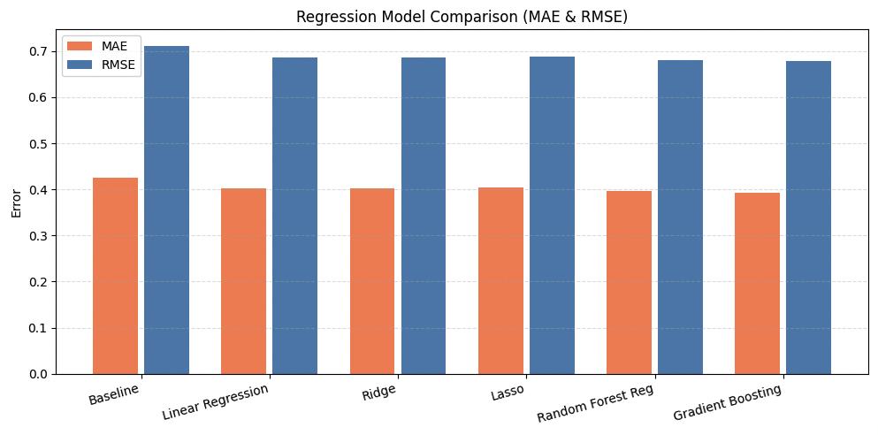

The image above shows the comparison of six regression models using MAE and RMSE to compare them. One of the most immediately obvious points that I have noticed with the bar chart is that all of the different regression models are very similar. The RMSE values in particular are clustered tightly. This tells me that the choice of regression model actually didn't make much of a different to the outcome. The Baseline model (which predicts the mean value everytime), has the highest MAE and RMSE values. This confirms that the model is actually learning from the data rather than just displaying a simple heuristic value each time.

# Innovative Work

* PCA - Cumulative Variance Explained

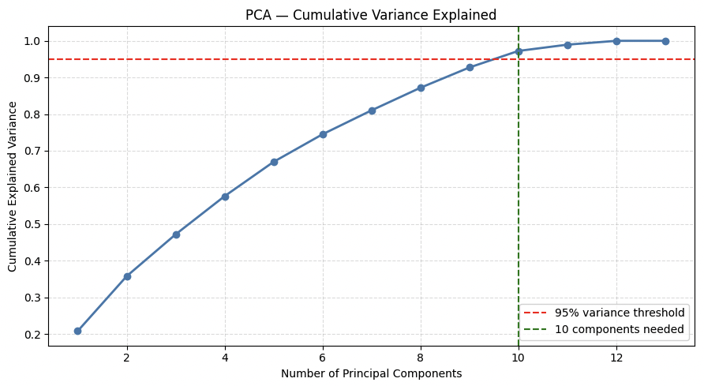

The graph above shows the PCA cumulative variance chart. This shows how much of the total information within the dataset is captured as more pricioiple components were added. On the graph, starting from one component which explained just above 0.2 (roughly 20%) of the variance. This increases dramatically throughout the chart until it reaches 10 principal components when it has passed the variance threshold and it begins to plateu through 11 and 12.

* Sheffield Collision Heatmap
One of the charts that I generated that I found most intersting was the heatmap of the ollisions that occured within Sheffield. For this, I have two different heatmaps. The first heatmap is not interactive and it shows the collisions that occcured, categorised. I found this idea really interesting as it gave me a clear visualisation of actually where the collisions had occurec, geographically. This was the easiest to interpret, especially on the interactive map which I will discuss below.s

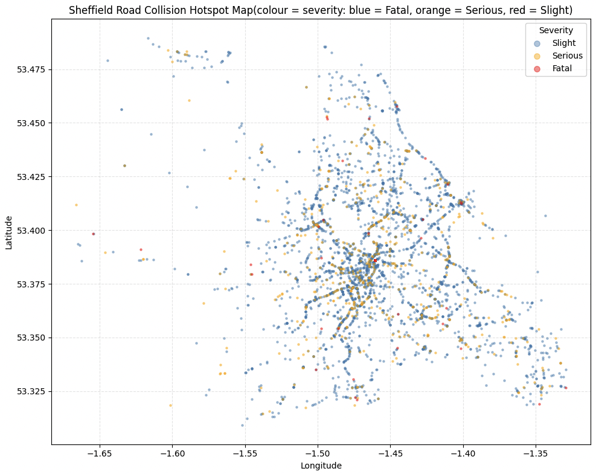

The image above shows the static version of the heatmap (that isn't interactive). This just provides clusters of points that with a map behind them, would be grographically accurate.

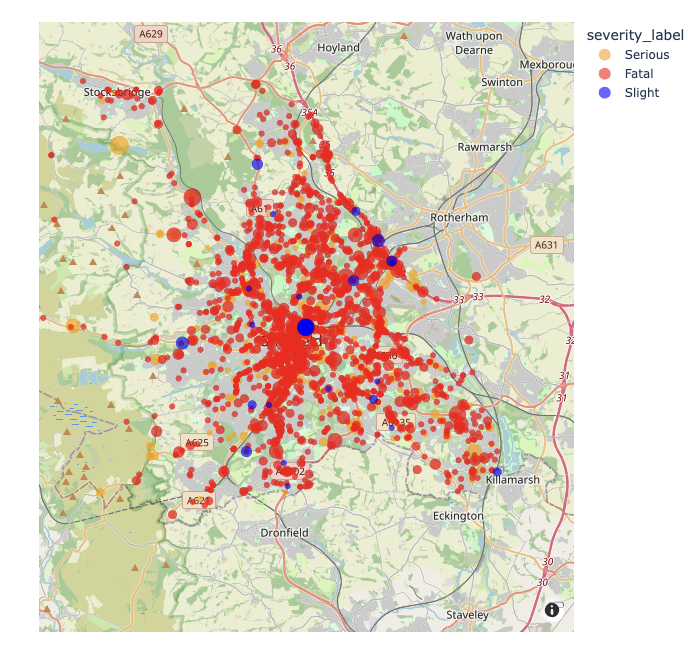

Initially, when I created my heatmap, I allocated the wrong labels to the wrong colours. This has now been fixed (as seen in the image above). However, for the image below, the I decided to leave this so I could show the heatmap being interactive and how I fixed the issue. I felt as if this was an important moment of learning as I had been careless here and made a silly error which meant that the data represented within my graph was entirely inaccurate. When the map has been activated (the user has hovered over one of the points), a pop up will display information for that specific accident. I will provide another example of this (with the fixed colour scheme), below the red one.

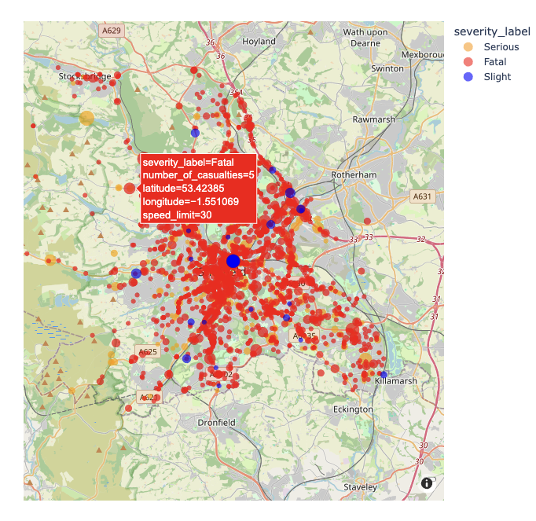

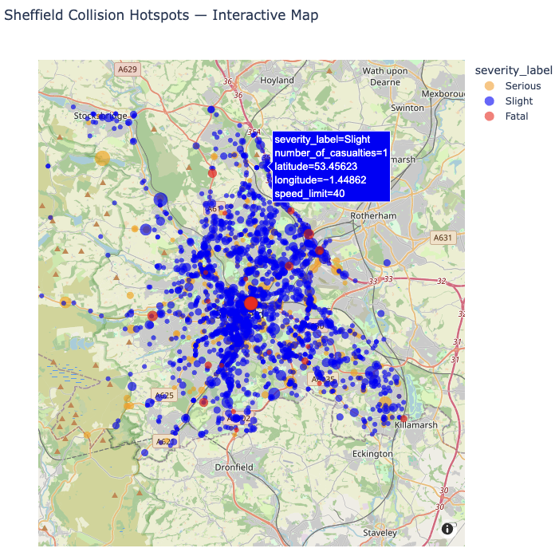

* Feature Importance (Gradient Boosting)

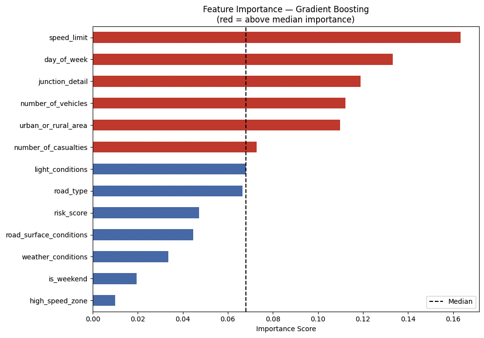

The graph above clearly shows that speed_limit is the most impotant factor during prediction. This has an importance score of roughly 0.16. This is shown in red on the graph as it sits above the median importance threshold (which is marked by the dashed line running vertically through the center of the graph). All of the features that are shown in red on the graph are of high importance to the model whilst predicting. We can see features here such as number_of_vehicles, day_of_week, number_of_casualties and urban_or_rural_area. These echo what we saw earlier in the other feature importance chart. As for the features displayed in blue, thes are of less importance when predicting. Again here, these echo what we saw earlier with the previous "Top 10 feature Importances" graph. I am happy to see similar results here.

* Engineered Feature Correlations - including a casualty count

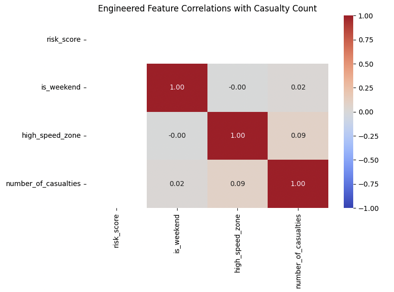

The image above shows the feature correlation heatmap which depicts the relationships between three of the features that I have engineered. These features are "is_weekend", "high_speed_zone" and "risk_score". From the graph, we can see that the high_speed_zone has the highest realtion to numer_of_casualties. This is to be expected as a higher speed would usually indicate a more severe collision (involving more casualties). None of the other featues seem to have a very strong relation to one another. With is_weekend showing a relation of just 0.02 with number_of_casualties. This confirms what I found earlier within the feature engineering setion. What I found was that whether or not a collision occurs on a weekend or a weekday has very little impact on the severity of the collison (how many casualties there are). This makes sense to me as the day of the week does not make a collision more severe. It may change the external factors (such as more traffic at certain times of the day), which could result in more collision. But it does not make a collision more severe.

* Seasonal Collision Trends

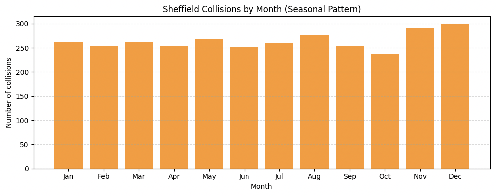

Looking at the seasonal collision trends bar chart above, we can see that throughout the year, the number of collisions remains relatively similar dipping or increasing slightly throughout the first few months of the year. One of the most prominent months here is december as it contains the highest number of collisions. This could be due to more people travelling for their christmas break, christmas itself visiting family or people making thier way to events on the final day of december before new years. There could also be certain environmental factors at play here as during the winter months, it could be icy. This could result in a higher number of crashes. These may not be driver error. It was interesting to me to see that throughout the year the collisions remain somewhat even as I initially believed there would be more collisions throughout the summer months. However, my findings of December being the month with the most collisions does make sense to me.

* My Dashboard

In order to work innovatively, I also decided to create a dashboard for my model. 

INSERT IMAGES

# Overall Summary & Conclusion

This has been taken from the end of the codefile.

* CLASSIFICATION FINDINGS:
  1. Speed limit is one of the strongest predictors of collision severity.
     High-speed zones (>60mph) are associated with more serious collisons.

  2. Urban areas account for the majority of collisions in Sheffield,
     but rural collisions tend to produce more severe outcomes due to
     higher speeds. This was confirmed by the urban_or_rural_area binary model.

  3. Weather and lighting conditions significantly influence accident
     severity. Night time accidents on dry roads are disproportionately severe,
     suggesting driver behaviour is a key factor alongside environmental conditions.

  4. Weekend driving patterns differ from weekdays. "is_weekend" was
     a useful engineered feature and helped to improve the performance of my model.

* REGRESSION FINDINGS:
  5. The Random Forest regression model outperformed linear models for
     predicting casualty counts, this shows non-linear relationships
     in road collision data.

  6. Collision frequency in Sheffield shows a long-term trend.
     Seasonal patterns show that collisions are frequent throughout the year.

* CLUSTERING FINDINGS:
  7. KMeans clustering revealed distinct accident profiles:
     high-speed, multi-vehicle collisions form one cluster,
     urban low-speed single-vehicle incidents form another.
     Eventually, these profiles could be used to put additional safety measures into place.

  8. DBSCAN identified noise points representing unusual/rare collisions
     that do not fit the standard patterns. These would be worth investigating separately.

* RESPONSIBLE AI:
  9. There was also a class imbalance (few Fatal vs many Slight collisions) was handled with
     class_weight='balanced'. The class imbalance means that models such as this should not be deployed
     or used within any real-world context as the data may be innacurate.

 10. Feature importance analysis (Explainable AI) improves the trust in
     model outputs by making decision drivers transparent to
     non-technical stakeholders such as Sheffield City Council.

Finally, my overall thoughts on the project were that it was extremely intersting. Through working on my model and producing a variety of graphs and seeing different results, I have learned so much. There were some things that especially surprised me throughout my work, such as certain trends within the data. For example, the number of collisions that occur on weekdays compared to within the week shocked me.

# My Dashboard

* Main Page

The first half of the main page of my dashboard is depicted below. On the first part of this page, the user can see an interactive Graph Builder. This allows the user to pick the type of chart they would like to generate along with teh X and Y variables for the chart. Another feature that I added was a radio button which allows the user to choose whether the dataset they would like to use is the cleaned dataset (After cleansing) or the raw dataset (Before cleansing).

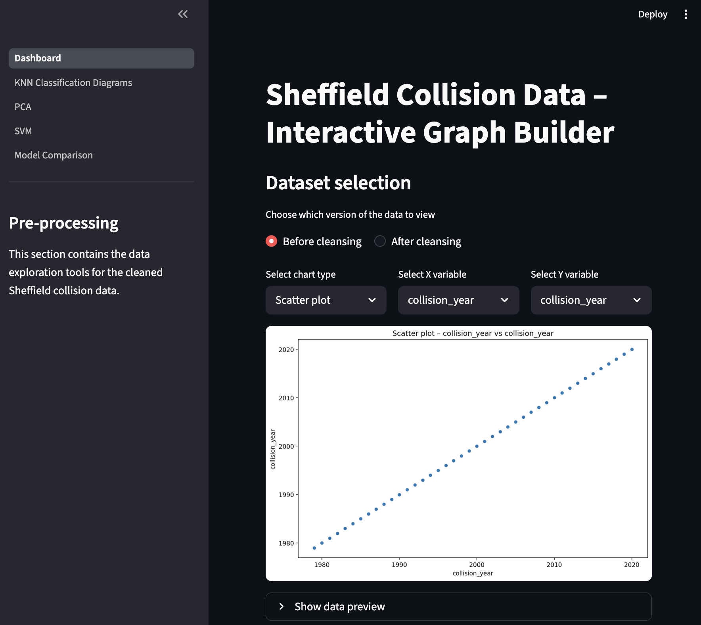

Below the interactive graph builder, there is a data preview drop down menu. This provides the user with the first 50 rows in the dataset. This is enough just to give them a brief understanding of the dataset. This section is shown within the image below.

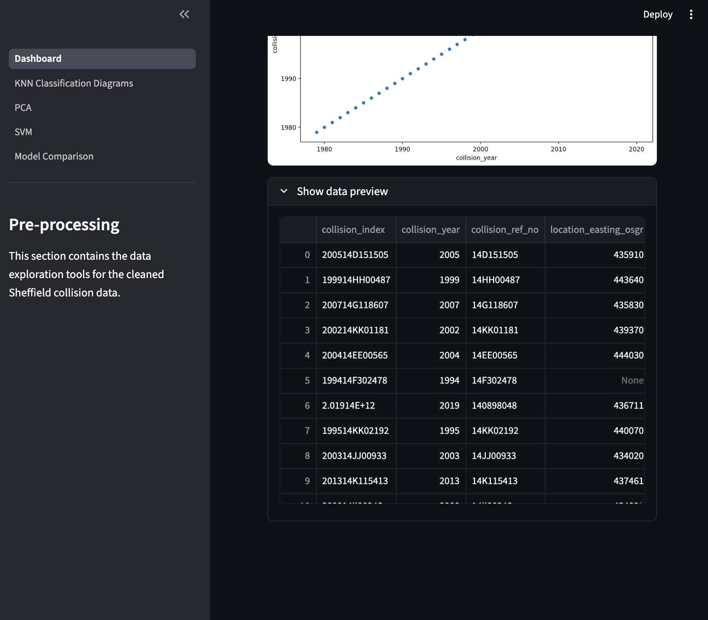

* KNN Classification Diagrams Page

The next page is the KNN Diagrams page. This is shown within the image below. On this page, the user can select the number of neighbours that they would like to see for their graph, they can also select the X and Y variables. In the example, the X and Y variables are collision_year and location_easting_osgr. When the user laods the page, they will see this example exactly as shown in the image.

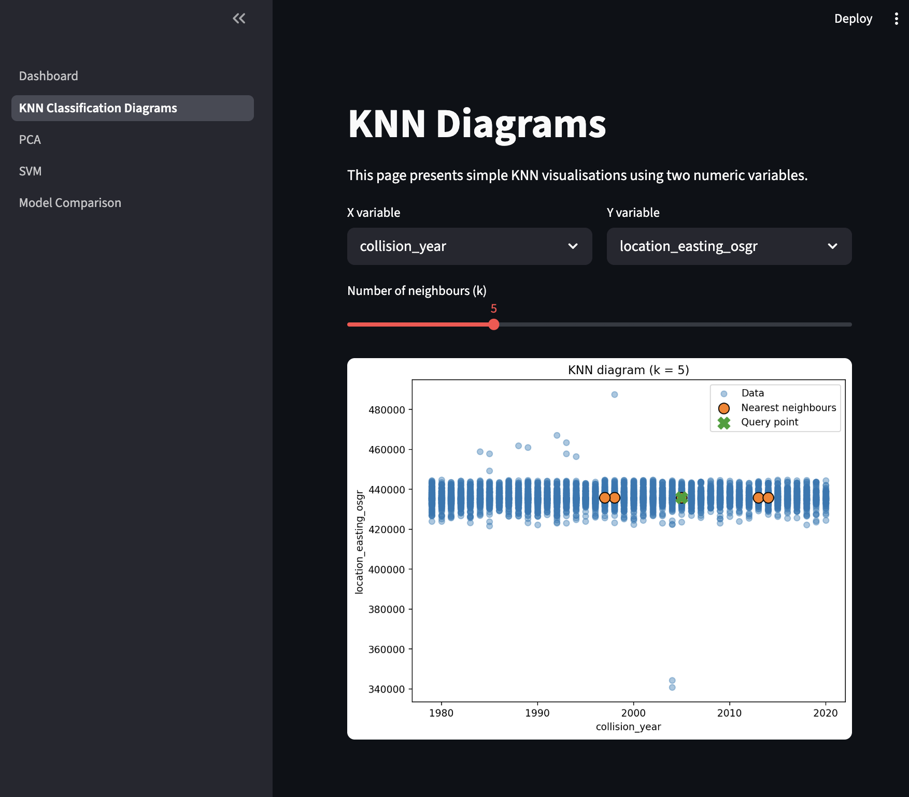

* PCA - Principal Component Analysis

As with the main page, the PCA page has been split into two differnt screenshots. The screenshot below shows a feature correlation matrix. It also describes the dataset used for the PCA (principal component analysis). Here, we can see the number of features used for the dataset (which, in this instance was 41).

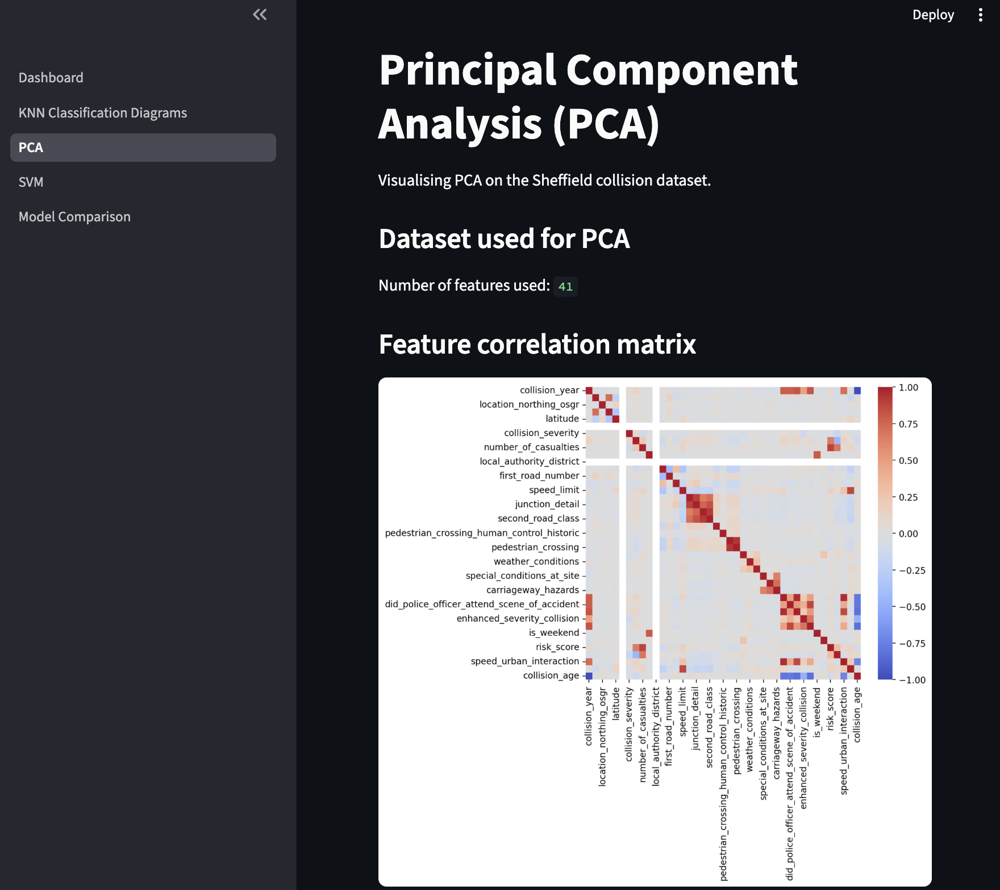

The second image (below) allows the user to change the PCA settings. They can change the number of principal components that are used for the graph which is shown below. The graph below the number of principal components slider is an explained variance of PCa components chart.

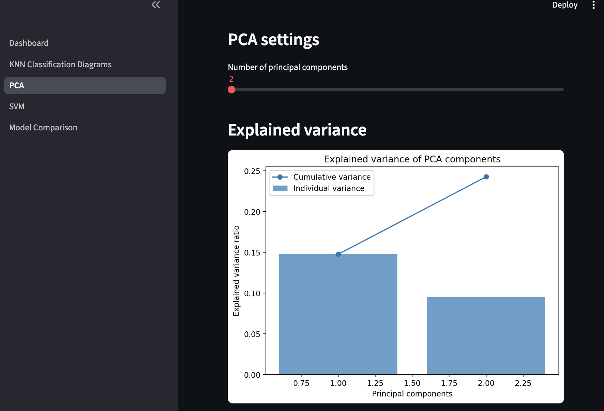

* SVM

Within the SVM page, shown below, the user can choose different models along with a different number of weather features to be used for the prediction of the severity. In this example, I used 9 weather conditions and the linear model. This predicted the collision severity to be a level 3. This is very severe.

The user is also presented with a graph that shows the Train vs test data distribution. The data split is shown on the graph too. With orange being the test data and the train data being the blue section.

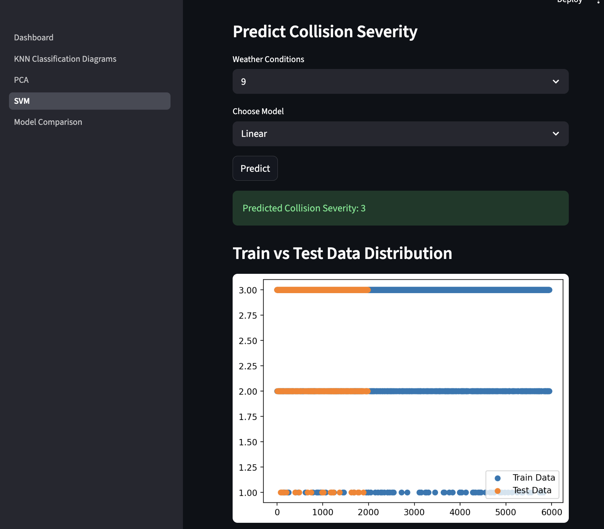

* Model Comparison

For the final page of the dashboard (the model comparison page), firstly, the user can see a model performance table. This shows the different models and their status (tuned or default), along with some statistics about them. For example, their accuracy, precision, recall, F1 score, RMSE value and R squared value. They can also see a graph comparing the models, below.

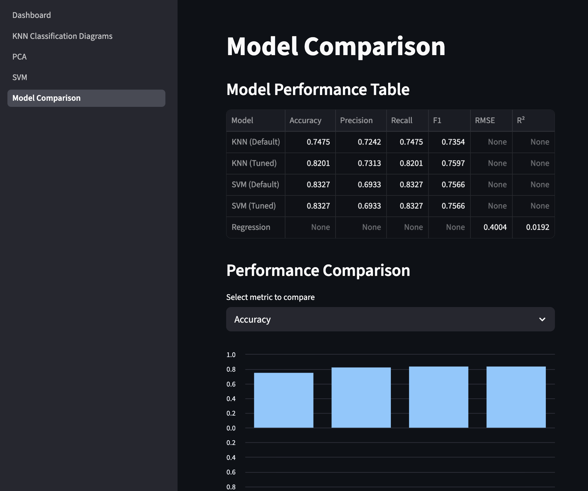

Within the second half of the page (seen below), the user is directly provided with a the result for the best classification model and the best regression model. As we can see here, the best classification model here was the SVM (default) model.

There are also some things that I would change about my model...

LEFT TO DO:

Video Presentation

Add in neural network work??
